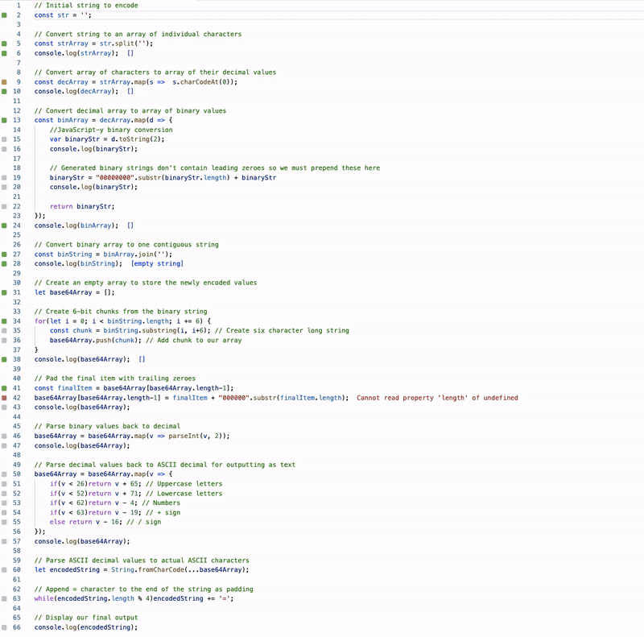

### Intro
In this post we will aim to answer the questions
1. What is Base64?
2. What abilities does it give us?
3. How is it implemented?
4. How can we efficiently create our own implementation?

### Understanding Base64
In simple terms, Base64 is a method of representing numbers between 0 and 255 (8-bit values) as numbers 0 through 63 (6-bit values). Say you needed to represent the number 120 but values over 63 weren't allowed for an arbitrary reason. You could instead use two values, 63 and 57, and tell the person receiving the values to add them together. Reducing these complex 8-bit values to a base 64 representation means the data can be shown via a simple alphanumeric and symbol character set (26 uppercase letters, 26 lowercase letters, numbers 0-9 and the / and + symbols make up the 64 values). This allows the resulting data, be it an image, song or program, to be transmitted by email, HTML, stored in an database and used generally anywhere plain text is allowed. The benefit of this is that, when transmitting or storing our data, we don't have to worry about how the devices involved handle the bits and low-level data storage which may affect typical binary data being transferred. As long as a boring text message can be transmitted, more complex data can be transmitted as well.

### Understanding Quokka.js
Quokka.js is a plugin available for several code editors that enables fast prototyping and testing from directly _within_ a text editor. The best feature I believe is having console output and results from variable manipulation shown inline with the subsequent code, allowing for minimal context switching and creating a great playground for developing and learning in the editor. Quokka will enable us to learn how to implement Base64 encoding and iterate on our routine all within the editor and with immediate feedback.


### Understanding Digital Text
To test our encoding we will encode a simple sentence of words. While this isn't the typical use of Base64 as the sentence can _already_ be transmitted via email, HTML and the rest, it will provide us with a simple dataset for testing purposes. Rather than seeing words and letters, see them as numbers. Within ASCII and UTF-8, the methods most software use in displaying or storing text, the uppercase alphabet A through Z is stored digitally as the decimal values 65 through 90, and the lowercase alphabet as values 97 through 122. For example, the word 'Man' would be 77(M), 97(a) and 110(n).

Therefore, the following sentence is in fact stored as the following decimal values:
```
T  e   m   p   t   i   n   g      T  i   m   e
84 101 109 112 116 105 110 103 32 84 105 109 101 
```
You'll notice that there aren't any spaces in the decimal representation. This is because the spaces themselves are represented by a unique value - `32`. This goes for many other symbols used, each having its own unique value.

When we take the sentence in its _decimal_ form, these numbers are stored in the computer's memory as 8-bit binary values as so:
```
01010100 01100101 01101101 01110000 01110100 01101001 01101110 01100111 00100000 01010100 01101001 01101101 01100101
```

In summary; a character is stored internally as a decimal number which is stored in binary as an 8-bit binary value

Once we understand these several different ways of viewing a single piece of information, we can move on to manipulating and encoding it.

### Encoding
Now that we have some binary data, lets convert it to the Base64 encoding. The way Base64 encoding works is all values will be converted _from_ 8-bit to **6-bit** representations. A simple method of doing this is as follows:

First, all 8-bit binary values for our data are treated as one long, continuous collection of zeroes and ones like so:

```
|   T   |   e   |   m  |
010101000110010101101101
```

Next, we slice this long string into 6-bit sections:
```
  8-bit   8-bit   8-bit
|      ||      ||      |
010101000110010101101101
|    ||    ||    ||    |
 6-bit 6-bit 6-bit 6-bit
  
```

You can see that, for the original three 8-bit sections, we know have **four** 6-bit sections. 

Converting these 6-bit binary values into decimal form we have:
`21 6 21 45`.

This can now be converted further into the Base64 alphanumeric form. A table can be seen [here](https://base64.guru/learn/base64-characters) for each character and it's decimal value and, after converting our decimal values to their character representations, we are left with:
`V G V t`

Finally, after converting the rest of our original two words, we eventually end up with the following string:
`V G V t c H R p b m c g V G l t Z Q`

We have successfully encoded a word to base64! While implementing such a method with text seems a little nonsensical, when applied to complex binary data, a similar text output would be generated, ready to be transmitted or stored via a wide range of methods.

Now, lets automate the above process with some JavaScript.

### Creating a JavaScript implementation
First, we will install the Quokka.js extension by opening the extensions tab in VS Code and searching for `Quokka.js`(note: Node.JS will need to be installed prior). Once installed, press either `CMD + SHIFT + P` or `CTRL + SHIFT + P` depending on your OS to access the command palette and search for `Quokka.js: New JavaScript File`. Don't worry about any pop-ups about the pro edition of Quokka, the free community edition has all core features. 

A quick run through of Quokka's features:
- Type `console.('Hello World');` and you'll see the output of the console right next to the line. This is very handy for tracking values, especially if you're like me and make plenty of typos and off-by-one errors along the way. 
- The green square that appears in the gutter, next to the line number displays code coverage. Green means the code ran, orange means the operation is part of a loop and only ran once and gray means it isn't being reached at all.

Now, onto our encoding program.

```js
// Initial string to encode
const str = 'Tempting Time';

// Convert string to an array of individual characters
const strArray = str.split('');
console.log(strArray);

// Convert array of characters to array of their decimal values
const decArray = strArray.map(s =>  s.charCodeAt(0));
console.log(decArray);

// Convert decimal array to array of binary values
const binArray = decArray.map(d => {
	//JavaScript-y binary conversion
	var binaryStr = d.toString(2);
	console.log(binaryStr);
	
	// Generated binary strings don't contain leading zeroes so we must prepend these here
	binaryStr = "00000000".substr(binaryStr.length) + binaryStr
	console.log(binaryStr);
	
	return binaryStr;
});
console.log(binArray);

// Convert binary array to one contiguous string
const binString = binArray.join('');
console.log(binString);

// Create an empty array to store the newly encoded values
let base64Array = [];

// Create 6-bit chunks from the binary string
for(let i = 0; i < binString.length; i += 6) {
	const chunk = binString.substring(i, i+6); // Create six character long string
	base64Array.push(chunk); // Add chunk to our array
}
console.log(base64Array);

// Pad the final item with trailing zeroes 
const finalItem = base64Array[base64Array.length-1];
base64Array[base64Array.length-1] = finalItem + "000000".substr(finalItem.length);
console.log(base64Array);

// Parse binary values back to decimal
base64Array = base64Array.map(v => parseInt(v, 2));
console.log(base64Array);

// Parse decimal values back to ASCII decimal for outputting as text
base64Array = base64Array.map(v => {
	if(v < 26)return v + 65; // Uppercase letters
	if(v < 52)return v + 71; // Lowercase letters
	if(v < 62)return v - 4; // Numbers
	if(v < 63)return v - 19; // + sign
	else return v - 16; // / sign
});
console.log(base64Array);

// Parse ASCII decimal values to actual ASCII characters
let encodedString = String.fromCharCode(...base64Array);

// Append = character to the end of the string as padding
while(encodedString.length % 4)encodedString += '=';

// Display our final output
console.log(encodedString);
```

Following the logging with Quokka, it should be quite easy to see each step of the encoding process. The comments should explain most of the program but we will touch on a few things. 

First, lines 16 through 26 deal with binary conversion in JavaScript. This is unique to the language and will not make a lot of sense if you have a strongly-typed language background. In JavaScript, performing `int.toString(2);` performs a binary conversion as `toString` takes a base parameter, which in our case is `2` for binary, and returns a string. The string returned is not always eight characters long however, as the number  `3` in binary is `11` but we need it to be padded to eight characters e.g `00000011`. Line 22 appends any required leading zeroes for padding, solving this issue. 

Lines 44 and 45 deal with an issue where, if our joined binary data is not divisible by six, the final 6-bit chunk of data will contain _less_ than 6-bits. If this is the case, trailing zeroes are appended to create a complete 6-bit value. For example, the binary values `1111` become `11110000`. This is achieved in a similar manner as above except with the zeroes being appended _after_ the existing binary data.

Finally, line 66 shows another padding method:
```js
// Append = character to the end of the string as padding
while(encodedString.length % 4)encodedString += '=';
```
This simply ensures that the length of the final string is a multiple of four. This is not _required_ to perform decoding successfully later on but _is_ helpful in some situations. To understand further, read [this great answer by TJM on StackOverflow](https://stackoverflow.com/a/26632221).

The beauty of using Quokka.js with this program is that we can see every step of the encoding practice live simply by changing the initial string to encode.


### Conclusion
Hopefully this has demystified some of the why's and how's about encoding data with the basic format that is Base64. It may seem like a function with few applications but, while transmitting of binary data can seem quite easy these days, Base64 is widely adopted, easily implemented and has stood the test of time. 

Also, now is a fantastic time to be a JavaScript developer. Plenty of tools such as Quokka are available, particularly in the VS Code environment, allowing increases in development efficiency while also just making development fun and convenient.

Below is the link to a GitHub gist containing the above encoding method, a decoding method and also an encoding method achieved using bit-shifting, something which would be more common in C/C++ or another language that isn't quite as loosey-goosey as JavaScript. 
